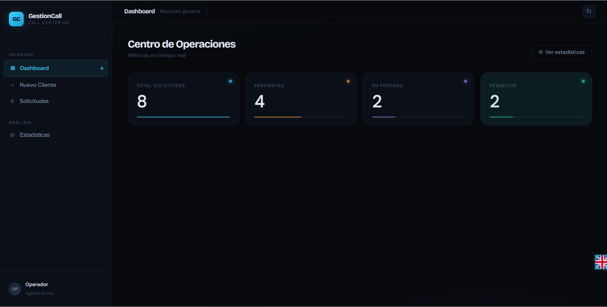
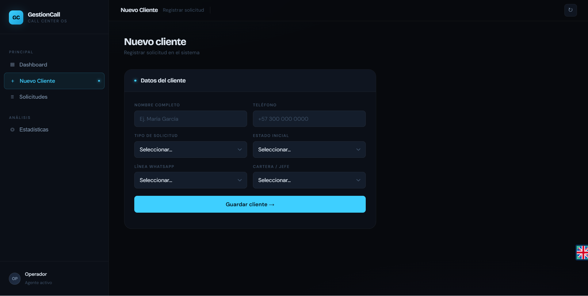
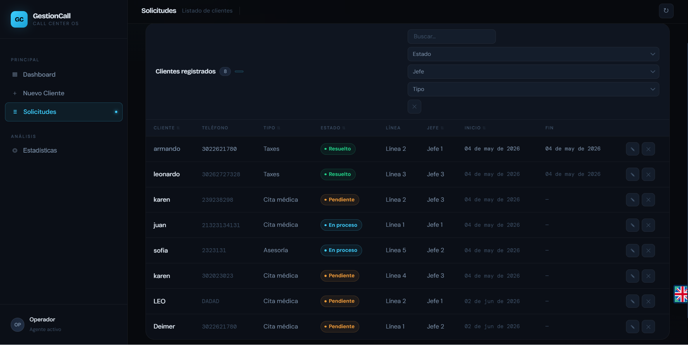

#  Sistema de Gestión de Clientes para Call Center

##  Descripción

Sistema web desarrollado para la **gestión, seguimiento y análisis de solicitudes de clientes en un Call Center**, permitiendo centralizar la información y mejorar la toma de decisiones.

La solución surge debido a la problemática de manejo de datos en múltiples herramientas, lo que generaba:

- Duplicidad de información  
- Errores en el registro  
- Falta de trazabilidad  
- Dificultad en el análisis de datos  

El sistema ofrece una interfaz moderna, intuitiva y funcional con visualización de datos en tiempo real.

---

## Objetivo General

Diseñar e implementar una aplicación web que permita:

- Centralizar la información de clientes  
- Gestionar solicitudes de forma estructurada  
- Dar seguimiento al estado de cada caso  
- Visualizar estadísticas dinámicas  
- Optimizar la toma de decisiones  

---

##  Tecnologías Utilizadas

- **Backend:** Python + Flask  
- **Frontend:** HTML5, CSS3, JavaScript  
- **Base de datos:** JSON -`data.json`-
- **Gráficas:** Chart.js  

---

## Arquitectura del Sistema

El sistema sigue una arquitectura cliente-servidor:

- **Frontend:** Interfaz de usuario -HTML, CSS, JS-
- **Backend:** API REST en Flask
- **Persistencia:** Archivo JSON como base de datos

---

## 📁 Estructura del Proyecto

```
GestionCall/
├── app.py # Backend Flask
├── data.json # Base de datos -clientes-
├── templates/
│ └── index.html # Interfaz principal
├── static/
│ ├── styles.css # Estilos
│ └── script.js # Lógica del frontend


```

##  Funcionalidades Principales

###  Gestión de Clientes
- Registrar clientes
- Editar información 
- Eliminar clientes con confirmación
- Manejo de estados:
  - Pendiente
  - En proceso
  - Resuelto

---

###  Control de Fechas
- Fecha de inicio automática al registrar
- Fecha de finalización automática al marcar como resuelto
- Seguimiento completo del ciclo del cliente

---

###  Dashboard en Tiempo Real
- Total de solicitudes  
- Cantidad de pendientes  
- En proceso  
- Resueltas  

---

###  Módulo de Estadísticas Avanzadas
Accesible mediante botón **"Ver Estadísticas"**

Incluye:

- Gráfica por:
  - Estados
  - Jefes 
  - Tipos de solicitud
  - Líneas de WhatsApp
- Filtros por tiempo:
  - Hoy
  - Últimos 7 días
  - Último mes
- Visualización dinámica 
- Modal interactivo con diseño moderno

---

###  Interfaz de Usuario
- Diseño limpio y moderno  
- Sidebar desplegable  
- Modales animados 
- Fondo con efecto blur al abrir ventanas  
- Botones estilizados 
- Responsive -adaptable a móviles-

---

##  Flujo de Funcionamiento

1. El usuario registra un cliente  
2. El frontend envía los datos al backend  
3. Flask guarda la información en `data.json`  
4. Se actualiza la tabla automáticamente  
5. Se recalculan métricas del dashboard  
6. Se actualizan las gráficas en tiempo real  

---

##  Ejecución 

### 1. Clonar repositorio
```
git clone https://github.com/leonardo-200224/GestionCall.git
2. Instalar dependencias
pip install flask
3. Ejecutar servidor
python app.py
4. Abrir en navegador
http://127.0.0.1:5000
```


